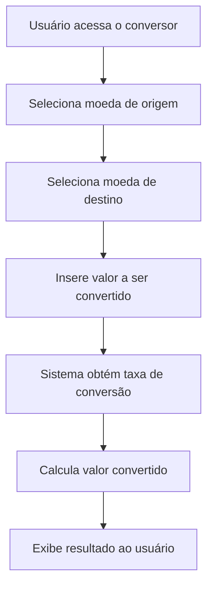

# 📄 Documentação Técnica – Conversor de Moedas

## 1. Descrição da Funcionalidade
O **Conversor de Moedas** é uma funcionalidade que permite ao usuário converter valores entre diferentes moedas de forma simples e rápida.  

O sistema deve:  
- Permitir a escolha da moeda de origem e da moeda de destino.  
- Permitir a inserção do valor a ser convertido.  
- Calcular automaticamente o valor equivalente com base em taxas de câmbio pré-definidas ou obtidas via API externa.  
- Exibir o valor convertido com no mínimo **duas casas decimais**, realizando arredondamento correto.  

**Exemplo de uso:**  
- Entrada: `100 BRL` → destino: `USD`  
- Saída: `100 BRL = 19.23 USD`  

---

## 2. Diagrama de Fluxo



---
## 3. Interfaces Necessárias

#### Interface de Entrada

- Campo de seleção (dropdown) para moeda de origem.

- Campo de seleção (dropdown) para moeda de destino.

- Campo numérico para valor a ser convertido.

- Botão de “Converter”.

#### Interface de Saída

- Exibição do valor convertido em formato claro para o usuário.

- Interface de Erros

- Mensagem de erro se a moeda não for suportada.

- Mensagem de erro caso a API esteja indisponível.

- Validação para impedir valores negativos ou entradas inválidas.

#### Atividade

- Para fins da realização da atividade, a interface do usuário será a própria linha de comando, com direcionamentos de fácil entendimento. Mas com absoluta certeza, a implementação de um front-end específico para essas funções seria de grande interesse para o andamento do projeto.

---
## 4. Banco de Dados ou Detalhes de Armazenamento

O sistema não necessita de banco de dados persistente. Existem duas abordagens possíveis:
#### Taxas de câmbio pré-definidas

Exemplo armazenado em um dicionário Python:

```python
    rates = {
        ("USD", "BRL"): 5.00, # Números de exemplo apenas
        ("BRL", "USD"): 0.20,
        ("USD", "EUR"): 0.9,
        ("EUR", "USD"): 1.1
    }
```

Simples e suficiente para um protótipo.

#### Integração com API em tempo real (opcional, versão avançada).

Exemplo: Exchangerate.host ou OpenExchangeRates.

Requer conexão com a internet para obter taxas atualizadas.

---
## 5. APIs ou Serviços Externos Envolvidos

Versão básica: Nenhum serviço externo (apenas taxas internas fixas).
Versão avançada: Uso de uma API de câmbio em tempo real.

Exemplo de chamada usando Exchangerate.host:

```sql
GET https://api.exchangerate.host/convert?from=USD&to=BRL&amount=100
```

Resposta JSON:

```json
{
  "success": true,
  "query": {
    "from": "USD",
    "to": "BRL",
    "amount": 100
  },
  "info": {
    "rate": 5.20 # Exemplo apenas
  },
  "date": "2025-09-28",
  "result": 520
}
```

---
## 6. Critérios de Aceitação

- O conversor deve permitir que o usuário selecione a moeda de origem e a de destino.

- O usuário deve ser capaz de inserir a quantidade a ser convertida.

- O conversor deve exibir o valor convertido corretamente.

- Os resultados devem ter mínimo duas casas decimais, com arredondamento correto.

- O sistema deve tratar erros de entrada (valores inválidos ou negativos) e indisponibilidade de API (se utilizada).